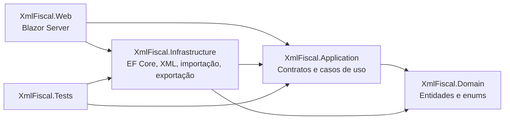
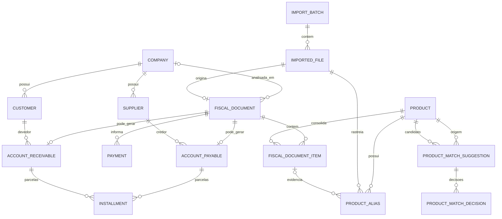
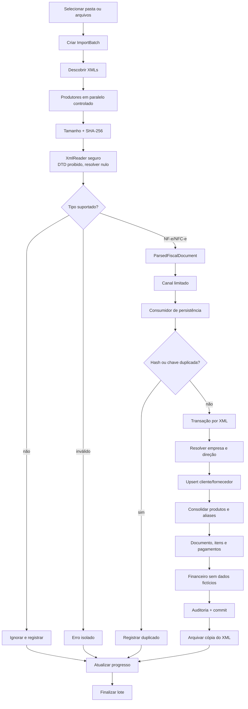

# Arquitetura proposta — XML Fiscal

## 1. Arquitetura

A solução usa Clean Architecture pragmática em quatro camadas e um projeto de testes:



### Responsabilidades

| Projeto | Responsabilidade |
|---|---|
| `XmlFiscal.Domain` | Entidades persistentes, relacionamentos navegáveis, enums e regras estruturais. Não depende de EF Core ou interface web. |
| `XmlFiscal.Application` | DTOs, contratos de serviços, normalizadores, algoritmo de matching e resolução de entrada/saída. |
| `XmlFiscal.Infrastructure` | Parser seguro, pipeline de importação, consolidação, EF Core/SQLite, migrações, consultas e exportação. |
| `XmlFiscal.Web` | Interface Blazor, composição de dependências e inicialização do banco. |
| `XmlFiscal.Tests` | Testes de normalização, matching, direção, deduplicação, parsing, segurança e importação integrada. |

O núcleo de parsing é aberto a novos detectores/parsers. `XmlDocumentDetector` já reconhece famílias CT-e e MDF-e como tipos conhecidos, mas a primeira etapa rejeita esses documentos de modo controlado até que os parsers específicos sejam implementados.

## 2. Estrutura de pastas

```text
src/
├── XmlFiscal.Domain/
│   ├── Common.cs
│   ├── Enums.cs
│   ├── Parties.cs
│   ├── Products.cs
│   ├── FiscalDocuments.cs
│   ├── Financial.cs
│   └── ImportAudit.cs
├── XmlFiscal.Application/
│   ├── Contracts.cs
│   ├── Interfaces.cs
│   ├── Options.cs
│   ├── Normalization.cs
│   ├── Matching.cs
│   └── PartyResolution.cs
├── XmlFiscal.Infrastructure/
│   ├── Persistence/
│   │   ├── XmlFiscalDbContext.cs
│   │   └── Migrations/
│   ├── Parsing.cs
│   ├── ProductConsolidation.cs
│   ├── Importing.cs
│   ├── QueryServices.cs
│   ├── ExportService.cs
│   └── DependencyInjection.cs
└── XmlFiscal.Web/
    ├── Components/
    │   ├── Layout/
    │   └── Pages/
    ├── wwwroot/
    ├── Program.cs
    └── appsettings.json

tests/XmlFiscal.Tests/
├── TestData/
└── *Tests.cs
```

## 3. Entidades do banco

| Entidade | Papel e campos-chave |
|---|---|
| `Company` | CPF/CNPJ analisado, razão social, fantasia e estado ativo. |
| `Customer` | Cliente por empresa; chave de deduplicação prioriza CPF/CNPJ. |
| `Supplier` | Fornecedor por empresa; chave de deduplicação prioriza CPF/CNPJ. |
| `Product` | Cadastro consolidado: GTIN, descrição normalizada, NCM, unidade, conteúdo, revisão e merge. |
| `ProductAlias` | Cada ocorrência original: XML, emitente, data, `cProd`, descrição e GTIN de origem. |
| `FiscalDocument` | Chave, modelo, série, número, datas, direção, partes, totais, protocolo e status financeiro. |
| `FiscalDocumentItem` | Dados comerciais/tributáveis originais e vínculo com o produto consolidado. |
| `Payment` | Forma e valor encontrados em `detPag`; dados de cartão quando presentes. |
| `AccountPayable` | Título de entrada associado a empresa, fornecedor e nota. |
| `AccountReceivable` | Título de saída associado a empresa, cliente e nota. |
| `Installment` | Número, vencimento opcional e valor; pertence a pagar ou receber, nunca aos dois. |
| `ImportBatch` | Lote, usuário, origem, datas, status e contadores. |
| `ImportedFile` | Caminho original/arquivado, hash, tamanho, tipo e resultado. |
| `ImportError` | Erro ou aviso associado ao lote e, quando possível, ao arquivo. |
| `ProductMatchSuggestion` | Par de produtos, score, evidências e estado da revisão. |
| `ProductMatchDecision` | Decisão humana, autor, data, notas e destino da mesclagem. |
| `AuditLog` | Ação, gravidade, entidade, usuário e dados JSON. |

### Índices e constraints principais

- `Company.TaxId` único;
- `FiscalDocument.AccessKey` único;
- `(CompanyId, DeduplicationKey)` único em clientes e fornecedores;
- `(FiscalDocumentId, ItemNumber)` único;
- índices em CPF/CNPJ, GTIN, NCM, descrições normalizadas, datas e status;
- GTIN **não** é único, pois o mesmo código com descrições conflitantes precisa coexistir até revisão;
- `Installment` possui check constraint garantindo apenas um proprietário;
- `ProductMatchSuggestion` impede origem e candidato iguais.

## 4. Relacionamentos



## 5. Fluxo completo de importação



### Decisões de desempenho

- XMLs não são acumulados na memória; cada arquivo é lido por `FileStream` e descartado;
- parsing paralelo é limitado por `ParserParallelism`;
- um `Channel` limitado aplica backpressure quando a persistência não acompanha os parsers;
- uma falha de arquivo não encerra o lote;
- cada XML válido usa sua própria transação;
- candidatos de produto são pré-filtrados e limitados, evitando varrer toda a tabela;
- consultas de dashboard e pesquisa usam projeções e `AsNoTracking`;
- os índices eliminam consultas N+1 nos eixos de identidade mais usados.

## 6. Estratégia de consolidação de mercadorias

### Identidade e rastreabilidade

`cProd` nunca identifica o cadastro mestre. Ele é preservado em `ProductAlias`, junto com emitente, arquivo, data, descrição e GTIN originais. O produto consolidado usa:

1. GTIN normalizado e validado pelo dígito verificador;
2. descrição normalizada;
3. NCM;
4. unidade;
5. peso/volume extraído da descrição quando disponível.

### Normalização

`ProductDescriptionNormalizer`:

- converte para maiúsculas e remove acentos;
- remove pontuação sem apagar números;
- uniformiza `LITRO/LT/L`, `ML`, `KG`, `G`, `UN/UND`, `CX` e `PCT`;
- une medida e unidade (`2 L` → `2L`);
- preserva peso, volume, quantidade, sabor, modelo e tamanho.

`GtinNormalizer` aceita apenas 8, 12, 13 ou 14 dígitos com check digit válido e rejeita vazios, “SEM GTIN”, letras, zeros e códigos inválidos.

### Matriz decisória

| Evidência | Resultado |
|---|---|
| GTIN igual + descrição muito semelhante + medida compatível | consolidação automática, desde que não haja candidato concorrente equivalente |
| GTIN igual + descrição distante ou medida conflitante | novo produto provisório + revisão manual |
| Sem GTIN + descrição muito semelhante + NCM/unidade iguais | consolidação automática pelo limite configurado |
| Sem GTIN + score entre revisão e automático | revisão manual |
| GTINs válidos diferentes | produtos diferentes, mesmo com nomes parecidos |
| Medida diferente, como 1L versus 2L | bloqueia consolidação automática |

### Score padrão

- com GTIN igual: 60 pontos GTIN + até 30 descrição + 6 NCM + 4 unidade;
- sem GTIN: até 75 descrição + 15 NCM + 10 unidade;
- `95–100`: candidato automático, sujeito às travas;
- `70–94,99`: revisão;
- abaixo de `70`: diferente.

Todos os limites são alteráveis em configuração. Um empate entre candidatos automáticos também é encaminhado à revisão. Decisões de merge movem itens e aliases ao destino e mantêm o produto antigo como inativo e rastreável. Um alias já decidido é reaproveitado em importações futuras.

## 7. Tecnologias escolhidas

- .NET 8 / C# 12;
- ASP.NET Core Blazor Server;
- Entity Framework Core 8;
- SQLite para desenvolvimento;
- `IDbContextFactory` para isolamento de contextos em circuitos Blazor e importações longas;
- `System.Xml`/LINQ to XML com `XmlReaderSettings` seguro;
- `Channel<T>`, `Parallel.ForEachAsync`, `async/await` e streaming;
- ClosedXML para Excel;
- xUnit e SQLite em memória para testes.

## Segurança e consistência

- DTD proibido e `XmlResolver = null` contra XXE;
- limite de bytes antes do parser e limite de caracteres no documento;
- arquivo malformado vira erro do arquivo, não erro do lote;
- chave da NF-e e hash impedem duplicidade;
- vencimentos ausentes permanecem nulos;
- cópia permanente, hash, lote e aliases preservam a origem;
- ações automáticas e manuais geram auditoria.
